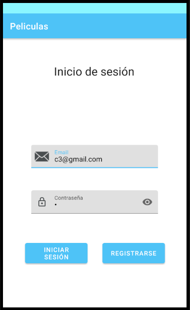
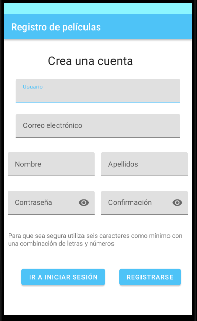
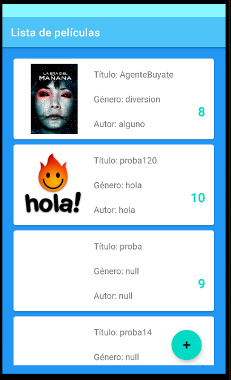
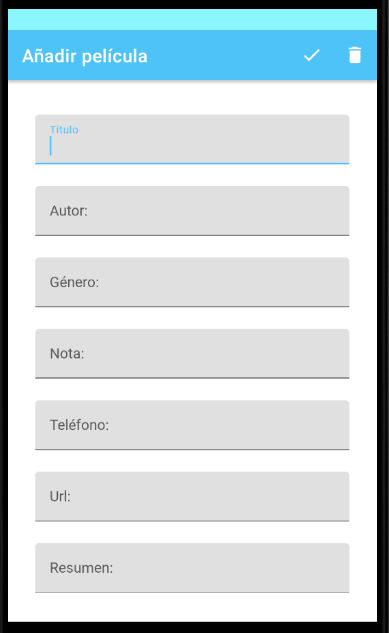

# JacoboCastroGonzález

## Aplicaión de lista de peliculas

### La aplicación dispone de:

1. Login

2. Registro 

3. Lista de películas

4. Detalle de cada película

5. Editar pelicula
6. Añadir película
7. Borrado de la película

Descripción: Inicia en el login, sino tienes usuario puedes ir a la pantalla de registro donde creas un usuario y se genera un token para acceder a la lista
de aplicaciones, ahí podras eliminar y editar películas para eso coge el id de la película, tambien se pueden añadir películas.
